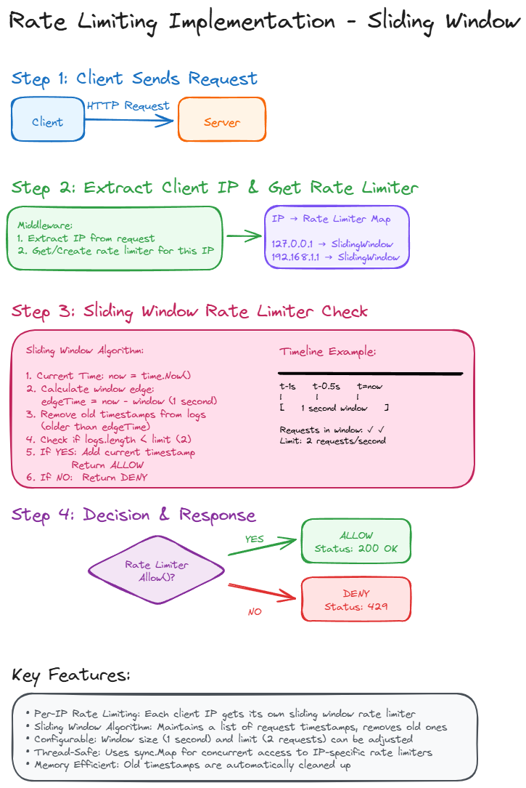
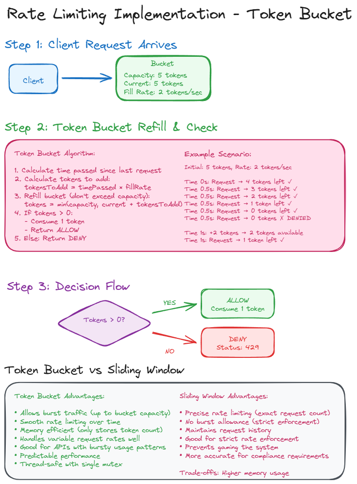

# Rate Limiting Implementation in Go

This project demonstrates two popular rate limiting algorithms implemented in Go: **Sliding Window** and **Token Bucket**. Both algorithms are used to control the rate of requests to protect APIs from abuse and ensure fair resource usage.

## Features

- **Per-IP Rate Limiting**: Each client IP gets its own rate limiter instance
- **Two Algorithm Implementations**: Sliding Window and Token Bucket
- **Thread-Safe**: Concurrent request handling with proper synchronization
- **HTTP Middleware**: Easy integration with any HTTP server
- **Configurable**: Adjustable rate limits and time windows

## Visual Explanations


_Sliding Window Algorithm: Tracks exact request timestamps within a time window_


_Token Bucket Algorithm: Allows controlled bursts while maintaining average rate_

## How It Works

### Sliding Window Algorithm

The sliding window algorithm maintains a precise log of request timestamps:

1. **Track Requests**: Store timestamp of each request in a list
2. **Clean Old Entries**: Remove timestamps older than the time window
3. **Check Limit**: Allow request if count is below the limit
4. **Memory Trade-off**: Uses more memory but provides exact rate limiting

**Use Case**: When you need strict, precise rate limiting without any burst allowance.

### Token Bucket Algorithm

The token bucket algorithm uses a bucket metaphor with tokens:

1. **Initialize Bucket**: Start with a bucket full of tokens
2. **Refill Tokens**: Add tokens at a constant rate over time
3. **Consume Tokens**: Each request consumes one token
4. **Allow Bursts**: Initial full bucket allows burst traffic

**Use Case**: When you want to allow controlled bursts while maintaining average rate limits.

## Configuration

Both algorithms are configurable in `main.go`:

```go
// Sliding Window: 2 requests per second
handler := rateLimiterMiddleware(mux, limiter.NewSlidingWindow(1, 2))

// Token Bucket: 2 tokens/sec with burst capacity of 5
handler := rateLimiterMiddleware(mux, limiter.NewTokenBucket(2.0, 5))
```

## Running the Project

### Start the Server

```bash
go run main.go
```

### Test with Client

```bash
go run client/main.go
```

The client will send 50 requests with 100ms intervals to demonstrate rate limiting in action.

## Algorithm Comparison

| Feature            | Sliding Window             | Token Bucket                |
| ------------------ | -------------------------- | --------------------------- |
| **Memory Usage**   | Higher (stores timestamps) | Lower (stores counters)     |
| **Burst Traffic**  | No bursts allowed          | Controlled bursts allowed   |
| **Precision**      | Exact rate limiting        | Average rate limiting       |
| **Use Case**       | Strict compliance          | Natural traffic patterns    |
| **Implementation** | List of timestamps         | Token counter + refill rate |

## Rate Limiting Flow

1. **Request Arrives** → Extract client IP
2. **Get Rate Limiter** → Retrieve or create limiter for IP
3. **Check Algorithm** → Apply sliding window or token bucket logic
4. **Decision** → Allow (HTTP 200) or Deny (HTTP 429)

## Thread Safety

- **Sliding Window**: Each IP gets its own limiter instance
- **Token Bucket**: Uses mutex for thread-safe token operations
- **IP Mapping**: `sync.Map` for concurrent access to IP-specific limiters

## Implementation Details

### Middleware Architecture

```go
func rateLimiterMiddleware(next http.Handler, rateLimiter limiter.RateLimiter) http.Handler {
    ipToLimiterMap := sync.Map{}
    return http.HandlerFunc(func(w http.ResponseWriter, r *http.Request) {
        ip := getClientIP(r)
        ipLimiter, _ := ipToLimiterMap.LoadOrStore(ip, rateLimiter)

        if !ipLimiter.(limiter.RateLimiter).Allow() {
            w.WriteHeader(http.StatusTooManyRequests)
            return
        }

        next.ServeHTTP(w, r)
    })
}
```

### Interface Design

```go
type RateLimiter interface {
    Allow() bool
}
```

Both algorithms implement this simple interface, making them interchangeable in the middleware.
